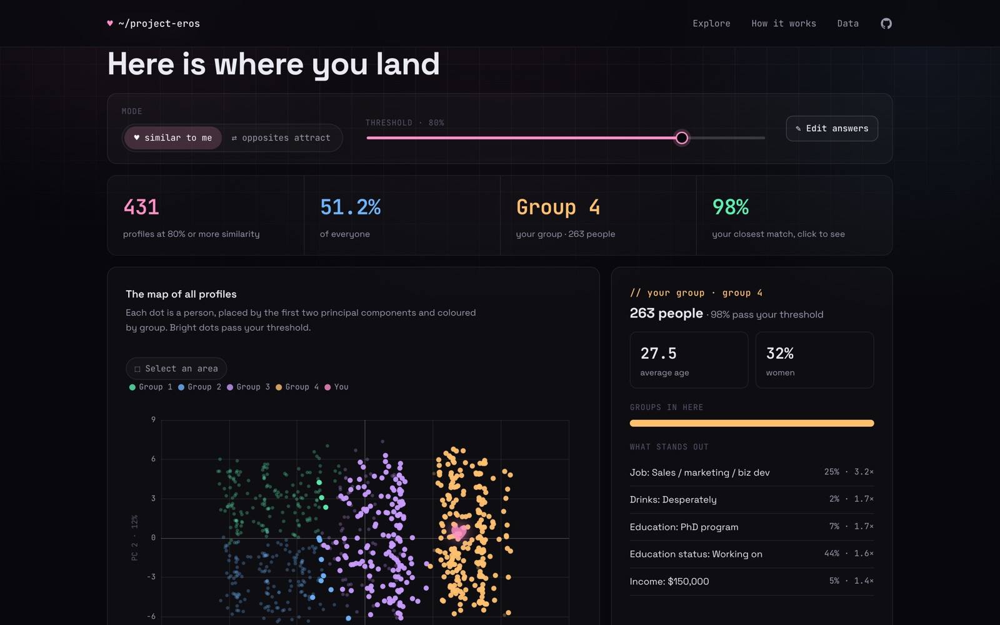
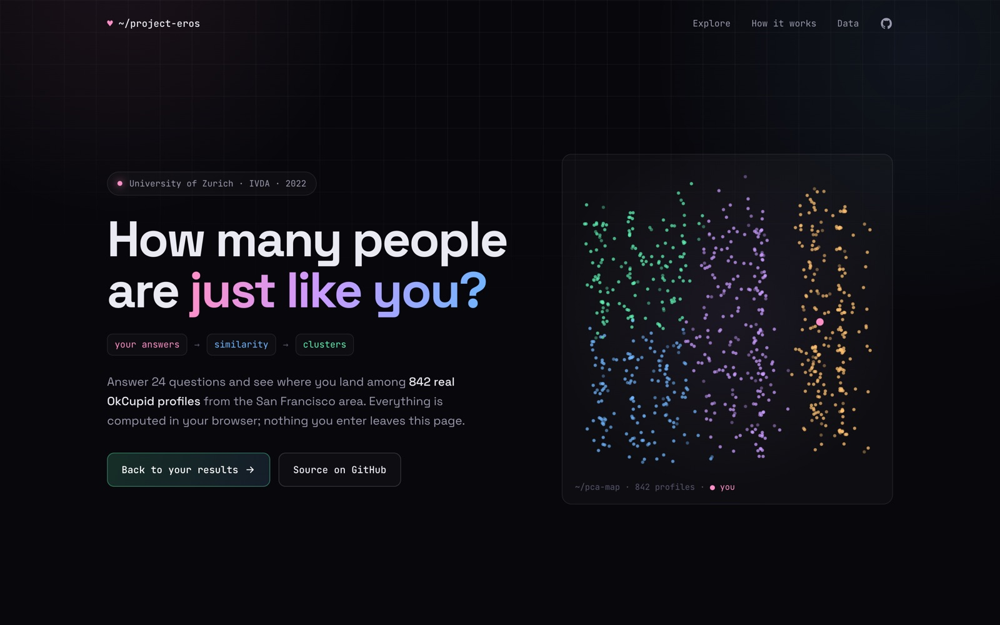
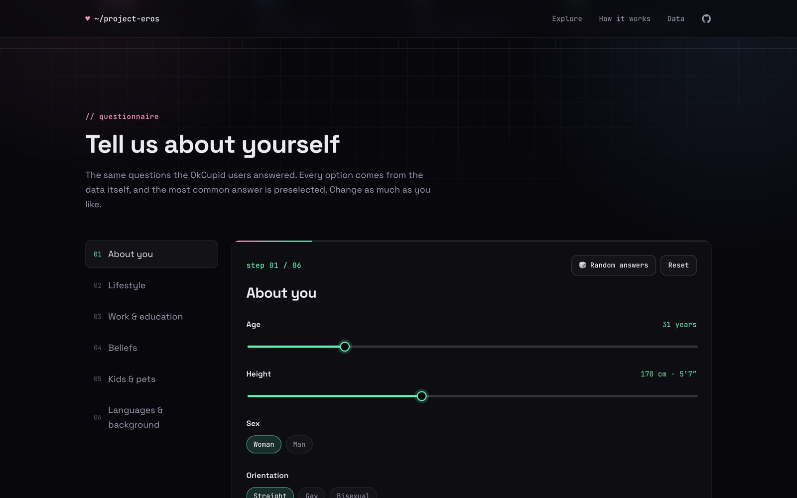
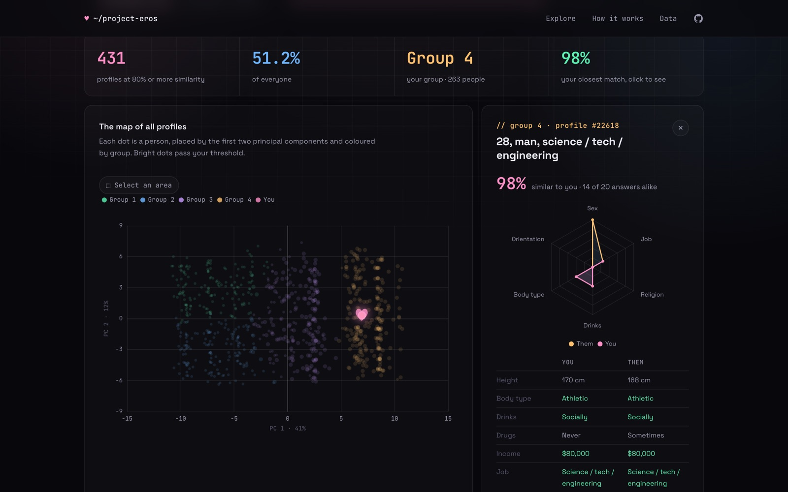
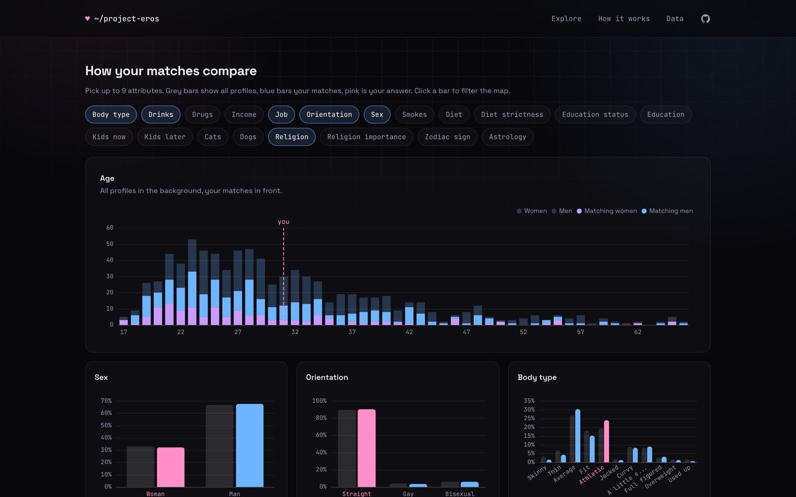
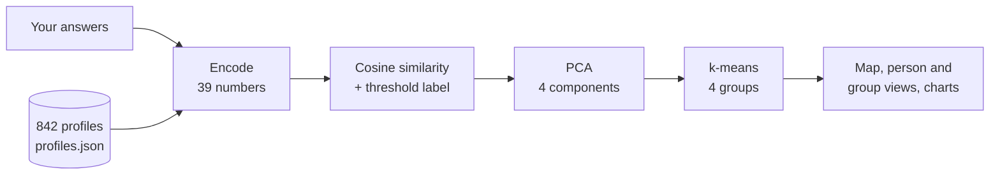

<div align="center">

# OkCupid Explorer (Project Eros)

**Answer a dating questionnaire and see where you land among 842 real OkCupid profiles**


[▶ Open the app](https://nicolas-huber.dev/okcupid-explorer/) · [Quick start](#quick-start) · [How it works](#how-it-works) · [Documentation](#documentation)



</div>

Project Eros asks you 24 questions about yourself (age, height, diet, drinking, education, religion, languages and so
on) and places you among 842 profiles from the public OkCupid dataset. It measures how similar each person is to you,
projects everyone onto a map with a principal component analysis and splits them into four groups with k-means. All of
it runs in your browser: there is no server, and your answers never leave the page.

This is the 2026 rebuild of a group project from 2022 (see [Author and context](#author-and-context)). The original
React app and Flask API are on the branch [`original`](../../tree/original); the analysis is the same and is tested
against the original Python code.

## Features

- 📝 Questionnaire in six steps; every answer option comes from the data, so every answer is valid
- 🎲 Random answers and a reset, answers saved in the browser
- 🗺️ PCA map of all profiles, coloured by group, with you as a pink heart
- ♥ Similarity or “opposites attract” mode and a threshold, both applied live
- 👤 Click a person: similarity score, radar chart and answer-by-answer comparison
- ⬚ Select an area: group size, mix of groups and the values that stand out
- 📊 Distribution charts for up to nine attributes, all profiles vs. your matches; click a bar to filter the map
- 🧮 Encoding, cosine similarity, PCA and k-means in TypeScript, checked against scikit-learn

> [!WARNING]
> The profiles are real, pseudonymised OkCupid profiles from the San Francisco area, including sensitive attributes
> such as ethnicity, religion, sexual orientation and drug use. They come from a dataset that OkCupid allowed to be
> published for teaching. See [Data](#data).

## Contents

- [Screenshots](#screenshots)
- [How it works](#how-it-works)
- [What changed since 2022](#what-changed-since-2022)
- [Tech stack](#tech-stack)
- [Repository structure](#repository-structure)
- [Quick start](#quick-start)
- [Development](#development)
- [Data](#data)
- [Deployment](#deployment)
- [Documentation](#documentation)
- [Known issues](#known-issues)
- [Author and context](#author-and-context)
- [Acknowledgements](#acknowledgements)
- [License](#license)

## Screenshots

| | |
|---|---|
|  |  |
|  |  |

## How it works



1. **Encode**: age and height are standardised, every other answer gets an integer code, languages and ethnicities
   become yes/no flags, as the 2022 API did with scikit-learn.
2. **Compare**: the cosine similarity of each profile to your answers; in “opposites attract” mode `1 − similarity`.
   Profiles at or above the threshold count as matches.
3. **Project**: a PCA with four components over all profiles, you and the match label.
4. **Group**: k-means with four groups, k-means++ seeding and ten restarts.

The engine is in [frontend/src/engine/](frontend/src/engine/). Its tests compare it with results computed by the Flask
API and scikit-learn: encoding and match labels are identical, the PCA agrees to 1e-6, and k-means finds groups at least
as compact as scikit-learn's. Details in [docs/architecture.md](docs/architecture.md).

## What changed since 2022

| Area | 2022 | Now |
|---|---|---|
| App | React 18 (Create React App) + Flask API | Vue 3 + TypeScript, static site |
| Analysis | Python (pandas, scikit-learn) on a server | TypeScript in the browser, tested against the Python code |
| Charts | ApexCharts 3 | Apache ECharts 6 |
| Design | Bootstrap cards | Dark design of [nicolas-huber.dev](https://nicolas-huber.dev) |
| Deployment | none | GitHub Pages |

Bugs of the 2022 version that the rebuild fixes:

- The questionnaire offered answers that no profile has (for example “does not like cats”, “scorpio,” or English
  switched off); the API then failed with an error 500.
- The API returned the coordinates of profile 0 for your own position (pandas aligned the appended row by its index).
- The scatter plot tooltip showed the wrong person for most points.
- Group numbers depended on k-means' internal order, so colours could change between runs; groups are now numbered
  from left to right.

## Tech stack

| Area | Technologies |
|---|---|
| App |     |
| Tests and linting |     |
| Data preparation and reference |      |
| Deployment |  |

## Repository structure

| Path | Content |
|---|---|
| [frontend/](frontend/) | The Vue app |
| [frontend/src/engine/](frontend/src/engine/) | Encoding, similarity, PCA and k-means, with tests |
| [frontend/src/data/](frontend/src/data/) | The 842 profiles as JSON, exported from the database |
| [backend/](backend/) | Data preparation (2022 notebooks and cleaning code), the Flask API as reference implementation, export script |
| [docs/](docs/) | Documentation and screenshots |
| [.github/workflows/](.github/workflows/) | CI and deployment |

## Quick start

Prerequisite: Node.js 24 (see [frontend/.nvmrc](frontend/.nvmrc)).

```bash
cd frontend
```

```bash
npm ci
```

```bash
npm run dev
```

Then open <http://localhost:3000>.

## Development

| Task | Command |
|---|---|
| Frontend tests | `npm test` (in `frontend/`) |
| Lint and type check | `npm run lint` and `npm run typecheck` |
| Production build | `npm run build`, then `npm run preview` |
| Re-export profiles and reference results | `uv run python scripts/export_frontend_data.py` (in `backend/`) |
| Backend tests and lint | `uv run pytest`, `uv run ruff check .` (in `backend/`) |

See [docs/development.md](docs/development.md).

## Data

| Data | Source | License / terms | In this repository |
|---|---|---|---|
| `profiles_revised.csv`, 59,946 profiles | [JSE_OkCupid](https://github.com/rudeboybert/JSE_OkCupid) (Kim & Escobedo-Land, 2015, revised 2021) | Published with OkCupid's permission on condition that it stays public; no formal license | No; [download script](backend/pipeline/download_data.py) |
| 842 cleaned profiles (`okcupid.sqlite`, `cleaned.csv`, `profiles.json`) | Derived from the dataset above by the 2022 pipeline | Same as the source | Yes, the app needs them |
| Plots and notebook outputs | Derived from the dataset above | Same as the source | Yes |

More in [docs/data.md](docs/data.md).

## Deployment

The app is a static site. On every push to `main` that changes `frontend/`, GitHub Actions tests and builds it and
publishes it to GitHub Pages. Setup in [docs/deployment.md](docs/deployment.md).

## Documentation

| Guide | Content |
|---|---|
| [docs/architecture.md](docs/architecture.md) | The engine, the app's components and state |
| [docs/data.md](docs/data.md) | Dataset, cleaning and derived files |
| [docs/development.md](docs/development.md) | Setup, tests, linting, where to change what |
| [docs/deployment.md](docs/deployment.md) | GitHub Pages |
| [docs/reference-api.md](docs/reference-api.md) | The 2022 Flask API, kept as reference implementation |
| [TODO.md](TODO.md) | Open tasks |

## Known issues

- The map's axes are almost single attributes: the first principal component is the job code (loading 0.99), the
  second the zodiac sign (0.98), which is why the map shows vertical bands. The 2022 analysis encodes categories as
  consecutive integers, so attributes with many values dominate the variance. A one-hot encoding would give a more
  meaningful map but would change the method; see [TODO.md](TODO.md).
- k-means cannot reproduce scikit-learn's random numbers, so group assignments can differ from the Python version for
  some inputs; the tests check that the groups are at least as compact.
- The notebooks in `backend/` use `pandas_profiling`, which does not support pandas 3; those cells do not run. The
  notebooks were not re-run.

## Author and context

Built in autumn 2022 as the group project of the course *Interactive Visual Data Analysis* (IVDA) at the University of
Zurich by group nvwd:

- [Daniel Lutziger](https://github.com/danielLutziger): frontend
- [Karim Abouel Naga](https://github.com/KarimAbouelNaga): landing page
- [Nicolas Peter Meyer](https://github.com/nicolaspetermeyer)
- [Nicolas Huber](https://github.com/HuberNicolas): data cleaning, analysis and backend

Rebuilt in 2026 by Nicolas Huber.

## Acknowledgements

The data comes from Albert Y. Kim and Adriana Escobedo-Land, *OkCupid Data for Introductory Statistics and Data
Science Courses*, Journal of Statistics Education 23(2), 2015,
[doi:10.1080/10691898.2015.11889737](https://doi.org/10.1080/10691898.2015.11889737), revised in 2021
([JSE_OkCupid](https://github.com/rudeboybert/JSE_OkCupid)). Permission to use the data was granted by OkCupid.

## License

The code is licensed under the [MIT License](LICENSE). The license does not cover the OkCupid data and files derived
from it (`backend/src/okcupid.sqlite`, `backend/pipeline/data/`, `frontend/src/data/`, plots and notebook outputs);
see [Data](#data).
