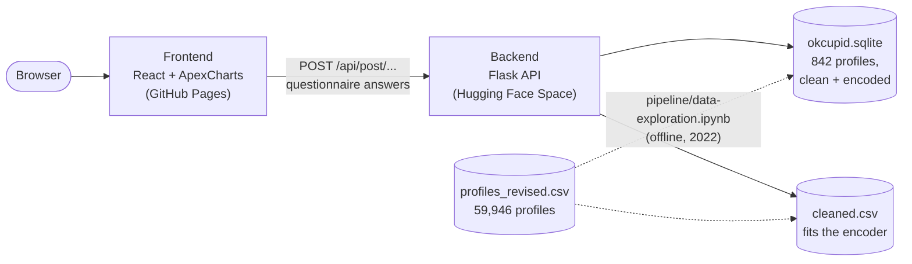

<div align="center">

# OkCupid Explorer (Project Eros)

**Answer a dating questionnaire and explore how similar you are to 842 real OkCupid profiles**


[Quick start](#quick-start) · [API](#api) · [Deployment](#deployment) · [Documentation](#documentation)

</div>

Project Eros asks you about yourself (age, height, diet, drinking, religion, languages and so on) and places you among
842 profiles from the public OkCupid dataset. The backend encodes all profiles, measures the cosine similarity to your
answers, reduces the data with PCA and groups it with k-means. The frontend shows the result as an interactive scatter
plot, bar charts per attribute and a radar chart that compares you with a single person.

## Features

- 📝 Questionnaire with 24 questions, a similarity threshold and a mode
- 🔁 Similarity or dissimilarity mode: find people like you, or the opposite
- 🧮 Cosine similarity, PCA (4 components) and k-means (4 groups) on every request
- 🔵 Scatter plot of all profiles by group, with a tooltip per person
- 📊 Distribution charts for up to nine attributes you pick; click a bar to filter the scatter plot
- 🕸️ Radar chart that compares you with the person you click

> [!NOTE]
> This is a student project from 2022 (see [Author and context](#author-and-context)). In 2026 the dependencies were
> brought up to date so that it runs and can be deployed again; the code itself is still the 2022 code. See
> [What changed since 2022](#what-changed-since-2022) and [Known issues](#known-issues).

> [!WARNING]
> The profiles are real, pseudonymised OkCupid profiles from the San Francisco area, including sensitive attributes
> such as ethnicity, religion, sexual orientation and drug use. They come from a dataset that OkCupid allowed to be
> published for teaching. See [Data](#data).

## Contents

- [What changed since 2022](#what-changed-since-2022)
- [Tech stack](#tech-stack)
- [Architecture](#architecture)
- [Repository structure](#repository-structure)
- [Quick start](#quick-start)
- [Configuration](#configuration)
- [API](#api)
- [Data](#data)
- [Development](#development)
- [Deployment](#deployment)
- [Documentation](#documentation)
- [Known issues](#known-issues)
- [Author and context](#author-and-context)
- [Acknowledgements](#acknowledgements)
- [License](#license)

## What changed since 2022

The two original repositories (`ivda-frontend` and `nvwd-server`) are merged into this one, with their full history.
The branch [`original`](../../tree/original) holds the unchanged 2022 state.

| Area | 2022 | Now |
|---|---|---|
| Frontend build | Create React App 5 | Vite 8 |
| Frontend libraries | React 18, Bootstrap 5.2, ApexCharts 3 | React 19, Bootstrap 5.3, ApexCharts 4.7 (last MIT release) |
| Backend | Python 3.8/3.10, no declared dependencies | Python 3.13, Flask 3, pandas 3, scikit-learn 1.9, managed with uv |
| API URL | hard-coded `http://127.0.0.1:5000` | `VITE_API_URL`, default `http://127.0.0.1:5001` |
| Raw dataset | committed (13 MB) | removed from the history, [download script](backend/pipeline/download_data.py) |
| Deployment | none | Docker image, GitHub Pages and Hugging Face Space workflows |

Code changes were limited to what the new versions required, plus bugs that surfaced on the way. The commit messages
explain each one; the main ones:

- `sklearn-pandas` no longer works with current scikit-learn; a `ColumnTransformer` encodes the same columns.
- `KMeans` now runs one initialisation by default; the API sets the old value of 10 explicitly.
- React 19 crashed on a `<body>` element inside the landing page.
- The scatter plot tooltip read an ApexCharts internal and showed the wrong person for most points.

## Tech stack

| Area | Technologies |
|---|---|
| Frontend |      |
| Backend |      |
| Data preparation |    |
| Tooling |      |
| Deployment |    |

## Architecture



| Part | Where | What it does |
|---|---|---|
| Frontend | [frontend/](frontend/) | Questionnaire, attribute selection and all charts |
| API | [backend/src/app.py](backend/src/app.py) | Encodes the answers, computes similarity, PCA and k-means per request |
| Data | [backend/src/okcupid.sqlite](backend/src/okcupid.sqlite), [backend/pipeline/data/cleaned.csv](backend/pipeline/data/cleaned.csv) | The 842 cleaned profiles the API works on |
| Data preparation | [backend/pipeline/](backend/pipeline/) | Cleaning functions and the notebook that produced the data |

More in [docs/architecture.md](docs/architecture.md).

## Repository structure

| Path | Content |
|---|---|
| [frontend/](frontend/) | React app (Vite) |
| [backend/src/](backend/src/) | Flask API, SQLite database, HTML templates of debug routes, example requests |
| [backend/pipeline/](backend/pipeline/) | Cleaning code, exploration notebook and plots, cleaned CSV, download script |
| [backend/dev/](backend/dev/) | Exploration notebooks from 2022 |
| [backend/tests/](backend/tests/) | Smoke tests of the API |
| [docs/](docs/) | Documentation |
| [.github/workflows/](.github/workflows/) | CI and deployment |

## Quick start

Prerequisites: [uv](https://docs.astral.sh/uv/) and Node.js 24 (see [frontend/.nvmrc](frontend/.nvmrc)).

1. Start the backend on port 5001 (port 5000 is taken by AirPlay on macOS):

   ```bash
   cd backend
   ```

   ```bash
   uv sync
   ```

   ```bash
   uv run flask --app src/app run --port 5001
   ```

2. In a second terminal, start the frontend:

   ```bash
   cd frontend
   ```

   ```bash
   npm ci
   ```

   ```bash
   npm run dev
   ```

3. Open <http://localhost:3000>, click **START**, open **Questionaire**, answer every question and click **Submit**.
   Then tick up to nine attributes under **Preselection** and click **Submit** again.

To run the backend in Docker instead:

```bash
docker build -t okcupid-explorer-backend backend
```

```bash
docker run --rm -p 5001:7860 okcupid-explorer-backend
```

## Configuration

| Variable | Where | Default | Meaning |
|---|---|---|---|
| `VITE_API_URL` | frontend, at build time | `http://127.0.0.1:5001` | Base URL of the API |
| `PORT` | backend Docker image | `7860` | Port gunicorn listens on |

The API allows requests from any origin (CORS).

## API

The frontend uses four endpoints. The three questionnaire endpoints take the answers, a threshold and a mode:

```json
{
  "threshold": 0.6,
  "mode": 1,
  "data": {"age": 29, "sex": "f", "height": 66, "income": 80000.0, "ethnicities": ["white"], "speaks": ["english", "german"], "...": "..."}
}
```

| Endpoint | Returns |
|---|---|
| `POST /api/post/users/nonstd` | All 842 profiles with PCA components, k-means group (`Segment`) and similarity label (`Label`) |
| `POST /api/post/users/std` | The same for the encoded profiles, with your answers appended as the last row |
| `POST /api/post/user/std` | Your answers, encoded |
| `POST /api/post/user/std/radar` | One profile (`{"data": {...}}`), encoded, for the radar chart |

`mode` is `1` for similarity and `0` for dissimilarity; a profile gets `Label: 1` when its (dis)similarity is at least
`threshold`. The other routes in `app.py` are development leftovers. Details in [docs/api.md](docs/api.md).

## Data

| Data | Source | License / terms | In this repository |
|---|---|---|---|
| `profiles_revised.csv`, 59,946 profiles | [JSE_OkCupid](https://github.com/rudeboybert/JSE_OkCupid) (Kim & Escobedo-Land, 2015, revised 2021) | Published with OkCupid's permission on condition that it stays public; no formal license | No; [download script](backend/pipeline/download_data.py) |
| `cleaned.csv`, `okcupid.sqlite`, 842 profiles | Derived from the dataset above by the 2022 pipeline | Same as the source | Yes, the API needs them |
| Plots and notebook outputs | Derived from the dataset above | Same as the source | Yes |

To download the raw data for the notebooks:

```bash
cd backend
```

```bash
uv run python pipeline/download_data.py
```

More in [docs/data.md](docs/data.md).

## Development

| Task | Command (in `backend/` or `frontend/`) |
|---|---|
| Backend tests | `uv run pytest` |
| Backend lint and format | `uv run ruff check .` and `uv run ruff format .` |
| Frontend tests | `npm test` |
| Frontend lint | `npm run lint` |
| Frontend production build | `npm run build`, then `npm run preview` |
| Notebooks | `uv run --group notebooks jupyter lab` |

See [docs/development.md](docs/development.md).

## Deployment

The frontend is a static site for GitHub Pages; the backend runs as a Docker Space on Hugging Face. Both deploy from
`main` through GitHub Actions. Setup steps in [docs/deployment.md](docs/deployment.md).

## Documentation

| Guide | Content |
|---|---|
| [docs/architecture.md](docs/architecture.md) | Request flow, what the API computes, frontend components |
| [docs/api.md](docs/api.md) | Endpoints and payloads |
| [docs/data.md](docs/data.md) | Dataset, cleaning and derived files |
| [docs/development.md](docs/development.md) | Local setup, tests, linting, where to change what |
| [docs/deployment.md](docs/deployment.md) | GitHub Pages and Hugging Face setup |
| [TODO.md](TODO.md) | Open tasks |

## Known issues

- For some inputs in similarity mode, k-means ends in a different (equally valid) grouping than in 2022: scikit-learn
  1.5 changed the sign convention of PCA components, which changes the k-means starting points. Similarity labels and
  the encoding are identical to 2022.
- The browser console shows `Expected moveto path command` and a `toLowerCase` error from ApexCharts 4.7 when a
  person or group is opened and the charts are redrawn. The charts are drawn correctly.
- The y axis of the scatter plot shows labels such as `8.0000000000000000` (as in 2022).
- Opening a person squeezes the charts on the left into a narrow column (as in 2022).
- The routes under `/api/dev/` return 500 with the example requests in `backend/src/requests/` (as in 2022). The
  frontend does not use them.
- The notebooks use `pandas_profiling`, which does not support pandas 3; those cells do not run. The notebooks were not
  re-run.

## Author and context

Built in autumn 2022 as the group project of the course *Interactive Visual Data Analysis* (IVDA) at the University of
Zurich by group nvwd:

- [Daniel Lutziger](https://github.com/danielLutziger): frontend
- [Karim Abouel Naga](https://github.com/KarimAbouelNaga): landing page
- [Nicolas Peter Meyer](https://github.com/nicolaspetermeyer)
- [Nicolas Huber](https://github.com/HuberNicolas): data cleaning, analysis and backend

Updated in 2026 by Nicolas Huber.

## Acknowledgements

The data comes from Albert Y. Kim and Adriana Escobedo-Land, *OkCupid Data for Introductory Statistics and Data
Science Courses*, Journal of Statistics Education 23(2), 2015,
[doi:10.1080/10691898.2015.11889737](https://doi.org/10.1080/10691898.2015.11889737), revised in 2021
([JSE_OkCupid](https://github.com/rudeboybert/JSE_OkCupid)). Permission to use the data was granted by OkCupid.

## License

The code is licensed under the [MIT License](LICENSE). The license does not cover the OkCupid data and files derived
from it (`backend/src/okcupid.sqlite`, `backend/pipeline/data/`, plots and notebook outputs); see [Data](#data).
