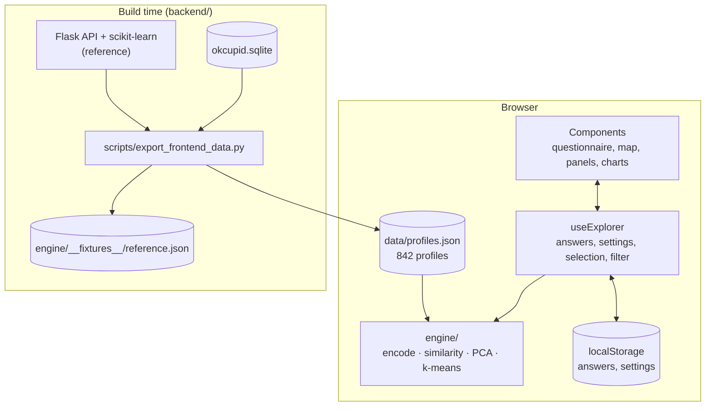

# Architecture

The app is a static Vue site. It loads the 842 profiles as JSON and runs the whole analysis in the browser.

## The engine

[frontend/src/engine/](../frontend/src/engine/) reproduces the analysis of the 2022 API:

| File | What it does |
|---|---|
| [columns.ts](../frontend/src/engine/columns.ts) | The 39 feature columns in the API's order; turns answers into a row like a profile |
| [encode.ts](../frontend/src/engine/encode.ts) | Fits and applies the encoding: `StandardScaler` (population standard deviation) for age and height, an integer code per sorted value for all other columns, rounding half to even to two decimals like `numpy.round` |
| [pca.ts](../frontend/src/engine/pca.ts) | PCA via the eigenvectors of the covariance matrix (Jacobi method), largest first, signs flipped like scikit-learn's `covariance_eigh` solver |
| [kmeans.ts](../frontend/src/engine/kmeans.ts) | k-means with greedy k-means++ seeding, 10 restarts, a seeded random generator and scikit-learn's relative tolerance |
| [analyze.ts](../frontend/src/engine/analyze.ts) | The pipeline: encode, cosine similarity, threshold label, PCA over the encoded rows plus the label, k-means on four components; groups are numbered by their position on the first axis |

The encoder and the encoded profiles do not depend on the answers and are computed once. A full analysis takes about
20 to 30 ms (measured in Node.js), so mode and threshold apply live.

[engine.test.ts](../frontend/src/engine/engine.test.ts) compares the engine with
[reference.json](../frontend/src/engine/__fixtures__/reference.json), which the export script computes with the Flask
API and scikit-learn for two sets of answers:

| Check | Result |
|---|---|
| Encoded answers | identical |
| Match labels of all 842 profiles | identical |
| PCA coordinates of all 843 rows | differ by less than 1e-6 |
| k-means | inertia slightly lower than scikit-learn's in both cases (0.006% and 0.4%); the test allows up to 0.1% above |

## State

[composables/useExplorer.ts](../frontend/src/composables/useExplorer.ts) holds the app state in module-level refs, so
every component shares it:

| State | Meaning |
|---|---|
| `answers`, `settings` | Questionnaire answers, mode and threshold; saved in `localStorage` |
| `analysis` | The engine's result, recomputed in the next animation frame after a change |
| `selection` | A clicked person or a selected area of the map |
| `filter` | An attribute value clicked in a distribution chart; hides other profiles on the map |
| `charts` | The attributes shown as distribution charts (up to nine) |

## Components

| Component | Role |
|---|---|
| [HeroSection](../frontend/src/components/HeroSection.vue) | Title and the PCA map of all profiles as an SVG constellation |
| [QuestionnaireSection](../frontend/src/components/QuestionnaireSection.vue) | Six steps with [ChoiceField](../frontend/src/components/ChoiceField.vue) and [RangeField](../frontend/src/components/RangeField.vue); options from [content/attributes.ts](../frontend/src/content/attributes.ts) |
| [ResultsSection](../frontend/src/components/ResultsSection.vue) | Mode and threshold, key figures, map and detail panel, distributions |
| [ScatterMap](../frontend/src/components/ScatterMap.vue) | ECharts scatter plot; click opens a person, brush selects an area |
| [DetailPanel](../frontend/src/components/DetailPanel.vue) | Your group, a selected area, or a person with radar chart and comparison |
| [AttributeChart](../frontend/src/components/AttributeChart.vue), [AgeChart](../frontend/src/components/AgeChart.vue) | Distributions of all profiles vs. matches |
| [MethodSection](../frontend/src/components/MethodSection.vue), [DataSection](../frontend/src/components/DataSection.vue), [FooterSection](../frontend/src/components/FooterSection.vue) | Explanations and credits |
| [EChart](../frontend/src/components/EChart.vue) | Thin wrapper around ECharts with resize handling; [charts/echarts.ts](../frontend/src/charts/echarts.ts) registers only the used chart types and sets the dark theme |

[insights.ts](../frontend/src/insights.ts) computes the values that stand out in a group (share in the group divided by
the share among all profiles, the strongest value per attribute) and the person comparison.

## Design

[styles/main.css](../frontend/src/styles/main.css) uses the design system of
[nicolas-huber.dev](https://nicolas-huber.dev): dark background with a grid and soft glows, Space Grotesk and JetBrains
Mono, and the accents green, blue, violet and amber, which are also the colours of the four groups. You are pink.
