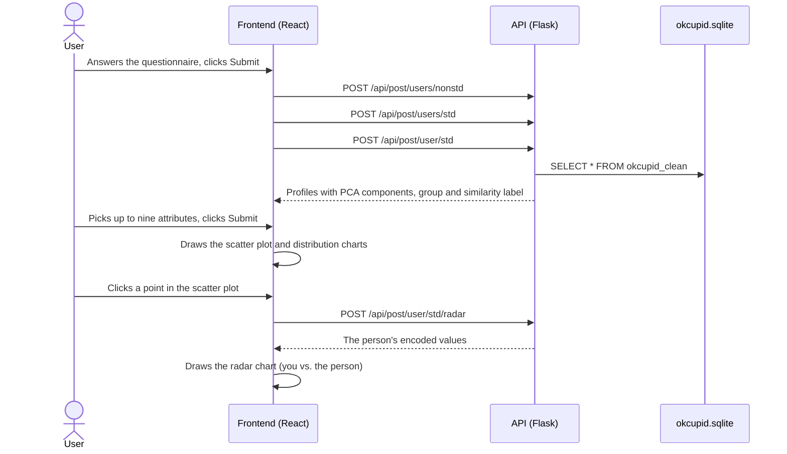

# Architecture

## Request flow

## What the API computes

For each questionnaire request, [backend/src/app.py](../backend/src/app.py):

1. Turns the lists `ethnicities` and `speaks` into one 0/1 column per value, as in the database.
2. Loads the 842 cleaned profiles from the table `okcupid_clean`.
3. Encodes profiles and answers with a `ColumnTransformer`: `StandardScaler` for `age` and `height`, an integer code
   (`OrdinalEncoder`) for every other column. It is fitted on the profiles, so an answer with a value that no profile
   has (for example an income that does not occur) fails with an error 500.
4. Computes the cosine similarity of every profile to the answers. In dissimilarity mode (`mode: 0`) it uses
   `1 - similarity`. Profiles at or above `threshold` get `Label: 1`.
5. Runs PCA with four components and k-means with four groups (`random_state=420`, 10 initialisations) on the encoded
   profiles and answers, including the label column.
6. Returns every profile with `PComp 1` to `PComp 4`, `Segment` (`first` … `fourth`) and `Label`.

Up to 2022 the encoding used `DataFrameMapper` from sklearn-pandas with a `LabelEncoder` per column; the
`ColumnTransformer` produces the same codes.

## Frontend components

| Component | Role |
|---|---|
| [App.jsx](../frontend/src/App.jsx) | Switches between landing page and main view |
| [LandingPage.jsx](../frontend/src/Components/LandingPage.jsx) | Intro text and START button |
| [ContentManager.jsx](../frontend/src/Components/ContentManager.jsx) | Main view; sends the questionnaire to the API and keeps the results |
| [FormCard.jsx](../frontend/src/Components/FormCard.jsx), [Form/](../frontend/src/Components/Form/) | Questionnaire and attribute selection, built from [fields.json](../frontend/src/Components/Form/fields.json) and [preselection.json](../frontend/src/Components/Form/preselection.json) |
| [PlotComponent.jsx](../frontend/src/Components/PlotComponent.jsx) | Layout of the charts; loads the radar data |
| [ScatterVis/ScatterComponent.jsx](../frontend/src/Components/ScatterVis/ScatterComponent.jsx) | Scatter plot of PComp 1 and 2 by group; click opens a person, a box selection opens the group view |
| [ScatterVis/GeneralInformation*.jsx](../frontend/src/Components/ScatterVis/) | Age distribution and one bar chart per selected attribute; clicking a bar filters the scatter plot |
| [DetailVis/Profile/](../frontend/src/Components/DetailVis/Profile/) | Person view with radar and bar charts |
| [DetailVis/GroupComparison/](../frontend/src/Components/DetailVis/GroupComparison/) | View of a box-selected group |
| [FilterReset.jsx](../frontend/src/Components/FilterReset.jsx) | Resets the bar chart filter |
| [Chart.js](../frontend/src/Chart.js) | Re-exports the ApexCharts React component (CommonJS interop) |
| [config.js](../frontend/src/config.js) | API base URL |
