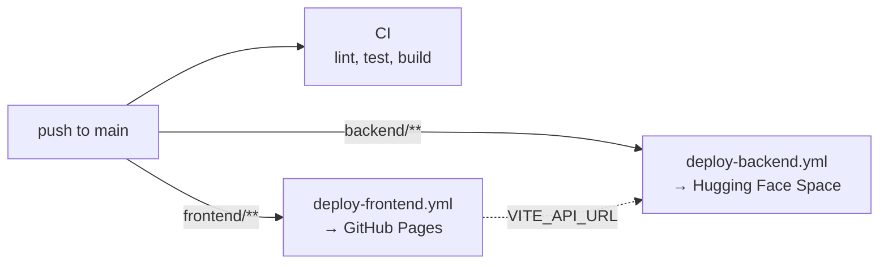

# Deployment

The frontend is a static site on GitHub Pages; the backend runs as a Docker Space on Hugging Face. Both are deployed by
GitHub Actions on every push to `main` that changes the respective folder.



## 1. Backend on Hugging Face

1. Create a Space on [huggingface.co/new-space](https://huggingface.co/new-space): SDK **Docker**, blank template,
   visibility public. A free CPU Space is enough; it sleeps after a period without requests and wakes up on the next
   one.
2. Create an access token with write access on [huggingface.co/settings/tokens](https://huggingface.co/settings/tokens).
3. In the GitHub repository, under *Settings → Secrets and variables → Actions*:
   - add the secret `HF_TOKEN` with the token;
   - add the variable `HF_SPACE` with the Space ID, for example `your-name/okcupid-explorer-api`.
4. Run the workflow *Deploy backend to Hugging Face* (Actions tab → *Run workflow*), or push a change in `backend/`.

The workflow adds the Space configuration (`README.md` with `sdk: docker` and `app_port: 7860`) and uploads
`backend/` without tests, notebooks and plots. The Space builds [backend/Dockerfile](../backend/Dockerfile).

The API is then at `https://<name>-<space>.hf.space`, for example `https://your-name-okcupid-explorer-api.hf.space`.
Check it with:

```bash
curl https://your-name-okcupid-explorer-api.hf.space/api/std/3
```

## 2. Frontend on GitHub Pages

1. Under *Settings → Pages*, set *Source* to **GitHub Actions**.
2. Under *Settings → Secrets and variables → Actions → Variables*, add `VITE_API_URL` with the Space URL from above
   (without a trailing slash).
3. Run the workflow *Deploy frontend to GitHub Pages*, or push a change in `frontend/`.

The site is then at `https://<user>.github.io/okcupid-explorer/`. The build uses relative asset paths, so it works
under that sub-path.

## Docker without Hugging Face

The image runs anywhere that runs containers. It listens on `$PORT` (default 7860):

```bash
docker build -t okcupid-explorer-backend backend
```

```bash
docker run --rm -p 5001:7860 okcupid-explorer-backend
```
